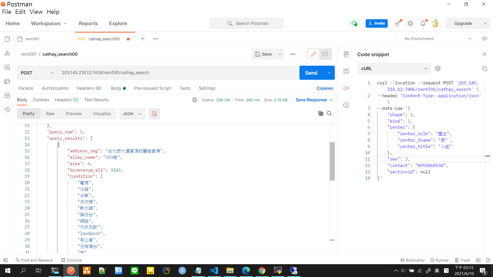

# README

本專案為國泰面試職位的考試題目

- 面試職位: 資料科學工程師
- 題目見: `./Take_Home_Exam.md`

詳細專案介紹請見 PDF 或是 PPTX 檔。  

---

## API 使用

- host: `203.145.218.12`
- post: `7406`
- endpoint: `/rent591/cathay_search`
- method: `POST`

```{json}
{
    "shape": 1,
    "kind": 3,
    "renter": {
        "renter_role": "屋主",
        "renter_fname": "李" ,
        "renter_title": "小姐"
    },
    "sex": 3,
    "contact": "0955860558",
    "sectionid": null
}
```

不需要的地方就用 null 取代

```{json}
{
    "shape": null,
    "kind": null,
    "renter": {
        "renter_role": null,
        "renter_fname": null ,
        "renter_title": null
    },
    "sex": 1, 
    "contact": null,
    "sectionid": null
}
```

Postman 結果如下



--
### cURL

```{curl}
curl --location --request POST '203.145.218.12:7406/rent591/cathay_search' \
--header 'Content-Type: application/json' \
--data-raw '{
    "shape": 1,
    "kind": 3,
    "renter": {
        "renter_role": "屋主",
        "renter_fname": "李" ,
        "renter_title": "小姐"
    },
    "sex": 3,
    "contact": "0955860558",
    "sectionid": null
}'
```

---

第一次用 python 寫專案，以下是觀摩其他人後的代辦事項

- 環境打包，讓其他人可以重現結果
- 建立 API 規格文件，讓其他人可以測試 API endpoint

---

## END
