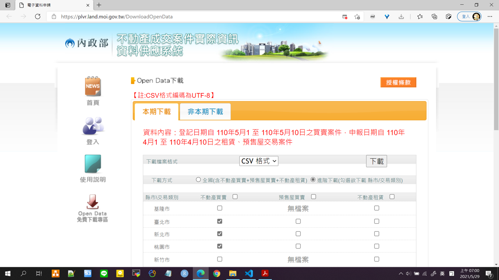

# Take Home Exam

這邊把 `Take home exam.pdf` 整理成習慣的 markdown 格式，  
並且記錄一些解題想法。

<!-- TOC -->

- [Take Home Exam](#take-home-exam)
  - [Question 01](#question-01)
    - [想法 for Q1](#想法-for-q1)
  - [Question 02](#question-02)
    - [想法 for Q2](#想法-for-q2)
  - [END](#end)

<!-- /TOC -->

---

## Question 01

資料源: [內政部不動產時價登錄網](http://plvr.land.moi.gov.tw/DownloadOpenData)

程式語言: python

**題目:**

1. 下載【內政部不動產時價登錄網】中，位於【臺北市/新北市/桃園市/臺中市/高雄市】的【不動產買賣】資料，請選擇【本期下載】。
2. 使用【pandas】套件，讀取檔名【a_lvr_land_a】【b_lvr_land_a】【e_lvr_land_a】【f_lvr_land_a】【h_lvr_land_a】五份資料集，建立 dataframe 物件【df_a】【df_b】【df_e】【df_f】【df_h】。
3. 操作 dataframe 物件，將五個物件合併成【df_all】。
4. 以下列條件從【df_all】篩選計算出結果，並分別輸出【csv 檔案】

- filter_a.csv  
  - 【主要用途】為【住家用】
  - 【建物型態】為【住宅大樓】
  - 【總樓層數】需【大於等於十三層】
- filter_b.csv
  - 計算【總件數】
  - 計算【總車位數】(透過交易筆棟數)
  - 計算【平均總價元】
  - 計算【平均車位總價元】

--

圖片截圖(自己截的，和 PDF 不一樣)

--

### 想法 for Q1

這是簡單的資料整理，下載 csv 資料後，  
進行簡單的合併、篩選、summarize
<!-- OK~ 你行的XD 用R作很快 -->

問題重點在於

- 中文、公部門的資料清理與操作
- 資料意義的解讀
- 輸出格式須為 CSV, UTF-8 編碼格式
- 透過 pandas 對 dataframe 做資料的 ETL 操作

延伸

- 未來是大資料的 csv 該如何操作?

---

## Question 02

資料源: [591房屋交易租屋網](https://rent.591.com.tw/?kind=0&region=1)

程式語言: python / java / scala 擇一
<!-- 嗚嗚嗚~ 沒有R的市場啦 -->
<!-- 我選擇死亡XDD -->

資料庫: MongoDB
<!-- OK這我也不會，只有在通勤的時候稍微學過 NoSQL 概念。 -->

**題目:**

1. 利⽤爬網技術取得 **【591房屋交易租屋網】** 中，位於 **【臺北及新北】** 的所有 **【租屋物件資料】** 。
2. 【租屋物件資料】至少須具有下列欄位

    - 出租者 (陳先生)
    - 出租者身份 (屋主)
    - 聯絡電話 (02 25569419)
    - 型態 (電梯大樓)
    - 現況 (獨立套房)
    - 性別要求 (男女生皆可)

3. 將租屋物件資料儲存在資料庫中。
4. **【設計/建立 RESTful API】** 供查詢下列資訊 **【 以 JSON 格式回傳，請自訂 Schema】**

    - **【男生可承租】** 且 **【位於新北】** 的租屋物件
    - 以 **【聯絡電話】** 查詢租屋物件
    - 所有 **【非屋主自行刊登】** 的租屋物件
    - **【臺北】【屋主為女性】【姓氏為吳】** 所刊登的所有租屋物件

5. 請 **【提出或實作營運化方法機制】** ，包含但不限於以下需求

    - 資料源更新機制
    - 資料庫設計
    - API 的效能保證
    - API 的規格文件

--

圖片截圖(自己截的，和 PDF 不一樣)  
沒辦法截圖是因為篩選條件有點詭異!?

- "非屋主自行刊登"，卻又要為吳姓女屋主?
- 位於新北的租屋條件，屋主是在台北?
- ...
- 喔不是啦~ 那是舉例篩選條件XD

--

### 想法 for Q2

這一題技術難度比較高

- 爬蟲
- MongoDB 操作
- 打包成 RESTful API
- 營運化方法機制

總之就要先爬取指定的資訊下來，整理成 json 的格式，  
因為後續要存入 MongoDB(NoSQL) 資料庫。

--

接著是建構 RESTful API，回傳的 json 格式可以自訂，
為配合 query parameter 的要求，  
建議爬取下來的資料，就先做好相關的整理，新增屬性(attribute)

**需要的屬性(attribute):**

| attribute            | description  | value            |
| -------------------- | ------------ | ---------------- |
| location             | 地點         | 臺北(台北)及新北 |
| latlon   (?)         | 經緯度       | (25.03, 121.56)  |
| renter               | 出租者       | 陳先生           |
| renter_firstname (?) | 出租者姓氏   | 陳               |
| renter_role          | 出租者身份   | 屋主             |
| contact_tel          | 聯絡電話     | (02-12345678)    |
| obj_type             | 型態         | 電梯大樓         |
| obj_situation        | 現況         | 獨立套房         |
| sex_tenant           | 性別要求     | 男女生皆可       |
| obj_renew            | 物件更新時間 | -                |

可能在想一下怎麼設計，有些應該可以變成 hierarchical 的格式。

- obj metadata
- renter metadata

--

最後也是我覺得最難的，營運化方法與機制，考慮

- 資料庫設計
  - 注意彈性
- 資料庫更新
  - 舊資料如何更新
  - 新資料如何更新
  - 排程頻率
- API 效能測試: 要怎麼測試效能?
- API 規格文件: 使用 swagger 說明，然後 Postman 操作截圖。

---

## 繳交要求

繳交內容與方式

- 請以 **<ins>簡報</ins>** 方式 呈現以下內容：
  1. 實作架構與處理過程說明
  2. 過程中遇到的問題與解決方法
- 請將 **<ins>包含.py之專案程式碼</ins>** 上傳至個人 github ，並提供連結。

---

## END
